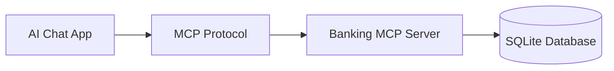
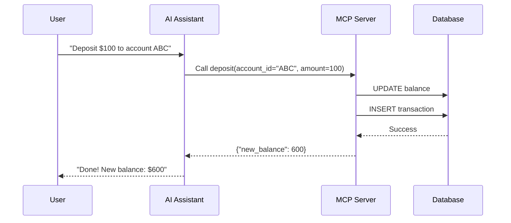
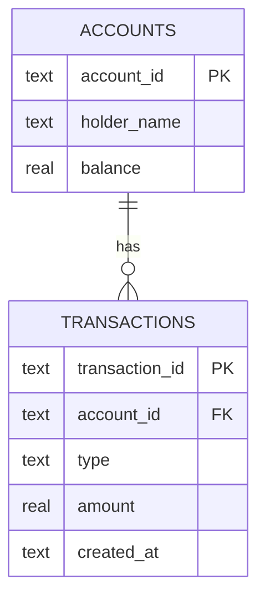

## Table of Contents

1. [Introduction: What Are We Building?](#introduction-what-are-we-building)
2. [Understanding MCP (Model Context Protocol)](#understanding-mcp-model-context-protocol)
3. [Project Dependencies](#project-dependencies)
4. [Data Architecture](#data-architecture)
5. [Implementation](#implementation)
   - [Database Layer](#database-layer)
   - [MCP Tools](#mcp-tools)
6. [Testing](#testing)
7. [Docker Deployment](#docker-deployment)
8. [Cloud Deployment](#cloud-deployment)
9. [Connecting AI Chat Apps](#connecting-ai-chat-apps)

---

## Introduction: What Are We Building?

### The Problem

AI assistants are incredibly powerful at understanding natural language and generating text. But what if you want them to **do things**: interact with databases, call APIs, or manage data? Out of the box, most AI models can't perform real-world actions.

### The Solution: MCP Servers

**MCP (Model Context Protocol)** provides a standardized way to give AI assistants access to external tools and data sources. By building an **MCP Server**, you can expose any functionality (creating records, reading data, updating entries, or deleting items) as tools that AI can call.

In this guide, we'll walk through building an MCP server step by step. The patterns you'll learn here apply to any CRUD application, whether you're building a task manager, inventory system, or user directory.

### What We're Building: A Banking Server



Our example exposes these banking operations as MCP tools:

| Tool               | What it Does                     |
| ------------------ | -------------------------------- |
| `create_account`   | Opens a new bank account         |
| `deposit`          | Adds money to an account         |
| `withdraw`         | Takes money from an account      |
| `get_balance`      | Checks the current balance       |
| `get_transactions` | Shows recent transaction history |

> [!TIP]
> Building something different? Just swap "accounts" and "transactions" with your own entities. The structure remains the same!

---

## Understanding MCP (Model Context Protocol)

### What is MCP?

**MCP (Model Context Protocol)** is a standard way for AI applications to communicate with external tools and services. Think of it as a "USB for AI": just like USB lets you plug any device into your computer, MCP lets you plug any tool into an AI assistant.

### Why Does MCP Matter?

Without MCP:

```
User: "What's my bank balance?"
AI: "I'm sorry, I don't have access to your bank account."
```

With MCP:

```
User: "What's my bank balance?"
AI: *calls get_balance tool* → "Your balance is $1,234.56"
```

### How MCP Works (Simplified)



### MCP Transport Methods

Our server uses **SSE (Server-Sent Events)** transport, which means:

- The server runs on HTTP
- AI clients connect via a URL
- Perfect for cloud deployment

---

## Project Dependencies

Our project uses minimal dependencies to keep things simple:

```toml
[project]
name = "zenith"
version = "0.1.0"
requires-python = ">=3.13"
dependencies = [
    "fastmcp>=2.14.1",
]

[dependency-groups]
dev = [
    "pytest>=9.0.2",
    "ruff>=0.14.10",
]
```

### What Each Dependency Does

| Package     | Purpose                                               |
| ----------- | ----------------------------------------------------- |
| **fastmcp** | The MCP framework that handles all the protocol magic |
| **pytest**  | Testing framework for our unit tests                  |
| **ruff**    | Code linter for Python (keeps code clean)             |

> [!NOTE]
> We're using **SQLite** which comes built into Python. No additional database installation needed!

---

## Data Architecture

### The Data Model

Our banking system needs to track two things:

1. **Accounts**: Who has money
2. **Transactions**: What happened to the money

### Entity Relationship Diagram



### Database Tables

**accounts table:**
| Column | Type | Description |
|--------|------|-------------|
| `account_id` | TEXT (PK) | UUID identifier |
| `holder_name` | TEXT | Customer name |
| `balance` | REAL | Current balance |

**transactions table:**
| Column | Type | Description |
|--------|------|-------------|
| `transaction_id` | TEXT (PK) | UUID identifier |
| `account_id` | TEXT (FK) | Links to account |
| `type` | TEXT | "DEPOSIT" or "WITHDRAWAL" |
| `amount` | REAL | Transaction amount |
| `created_at` | TEXT | ISO timestamp |

---

## Implementation

### Project Structure

```
src/zenith/
├── server.py              # MCP server + tools
├── database/
│   ├── connection.py      # SQLite connection
│   ├── schema.py          # Table definitions
│   └── operations.py      # CRUD operations
└── models/
    └── types.py           # Account, Transaction dataclasses
```

---

### Database Layer

#### Defining Our Models

First, we define what an Account and Transaction look like using Python dataclasses:

```python
# models/types.py
from dataclasses import dataclass

class TransactionType:
    """Constants for transaction types."""
    DEPOSIT = "DEPOSIT"
    WITHDRAWAL = "WITHDRAWAL"

@dataclass
class Account:
    """Represents a bank account."""
    account_id: str
    holder_name: str
    balance: float

@dataclass
class Transaction:
    """Represents a transaction record."""
    transaction_id: str
    account_id: str
    type: str
    amount: float
    created_at: str
```

> [!TIP]
> Using `@dataclass` gives us automatic `__init__`, `__repr__`, and more. Less boilerplate code!

#### Creating the Database Schema

The schema module defines our SQL tables:

```python
# database/schema.py
ACCOUNTS_TABLE_SQL = """
CREATE TABLE IF NOT EXISTS accounts (
    account_id TEXT PRIMARY KEY,
    holder_name TEXT NOT NULL,
    balance REAL NOT NULL DEFAULT 0.0
)
"""

TRANSACTIONS_TABLE_SQL = """
CREATE TABLE IF NOT EXISTS transactions (
    transaction_id TEXT PRIMARY KEY,
    account_id TEXT NOT NULL,
    type TEXT NOT NULL,
    amount REAL NOT NULL,
    created_at TEXT NOT NULL,
    FOREIGN KEY (account_id) REFERENCES accounts (account_id)
)
"""

def initialize_database() -> None:
    """Create database tables if they don't exist."""
    connection = get_connection()
    cursor = connection.cursor()

    cursor.execute(ACCOUNTS_TABLE_SQL)
    cursor.execute(TRANSACTIONS_TABLE_SQL)

    connection.commit()
    connection.close()
```

#### CRUD Operations

The operations module handles all database interactions. Here's how we create an account:

```python
# database/operations.py
import uuid
from .connection import get_connection
from ..models.types import Account

def create_account(holder_name: str) -> Account:
    """Create a new bank account."""
    account_id = str(uuid.uuid4())  # Generate unique ID
    initial_balance = 0.0

    connection = get_connection()
    cursor = connection.cursor()

    cursor.execute(
        "INSERT INTO accounts (account_id, holder_name, balance) VALUES (?, ?, ?)",
        (account_id, holder_name, initial_balance),
    )

    connection.commit()
    connection.close()

    return Account(
        account_id=account_id,
        holder_name=holder_name,
        balance=initial_balance,
    )
```

And here's how we record a transaction:

```python
def record_transaction(
    account_id: str,
    transaction_type: str,
    amount: float,
) -> Transaction:
    """Record a new transaction."""
    transaction_id = str(uuid.uuid4())
    created_at = datetime.now(timezone.utc).isoformat()

    connection = get_connection()
    cursor = connection.cursor()

    cursor.execute(
        """INSERT INTO transactions
           (transaction_id, account_id, type, amount, created_at)
           VALUES (?, ?, ?, ?, ?)""",
        (transaction_id, account_id, transaction_type, amount, created_at),
    )

    connection.commit()
    connection.close()

    return Transaction(
        transaction_id=transaction_id,
        account_id=account_id,
        type=transaction_type,
        amount=amount,
        created_at=created_at,
    )
```

---

### MCP Tools

This is where the magic happens! We define tools that AI assistants can call.

#### Setting Up the Server

```python
# server.py
from fastmcp import FastMCP

# Initialize the MCP server
mcp = FastMCP("Banking Server")
```

That's it! FastMCP handles all the protocol complexity.

#### The `create_account` Tool

```python
@mcp.tool()
def create_account(holder_name: str) -> dict:
    """Create a new bank account.

    Args:
        holder_name: Name of the account holder.

    Returns:
        Account details including the generated account ID.
    """
    account = db_create_account(holder_name)

    return {
        "message": "Account created successfully",
        "account_id": account.account_id,
        "holder_name": account.holder_name,
        "balance": account.balance,
    }
```

> [!IMPORTANT]
> The `@mcp.tool()` decorator is what makes this function available to AI assistants. The docstring becomes the tool's description!

#### The `deposit` Tool (with Validation)

```python
@mcp.tool()
def deposit(account_id: str, amount: float) -> dict:
    """Add funds to an existing account."""

    # Validate amount
    if amount <= 0:
        return {"error": "Amount must be positive"}

    # Find account
    account = get_account_by_id(account_id)
    if account is None:
        return {"error": "Account not found", "account_id": account_id}

    # Update balance
    new_balance = account.balance + amount
    update_account_balance(account_id, new_balance)

    # Record transaction
    record_transaction(account_id, TransactionType.DEPOSIT, amount)

    return {
        "message": "Deposit successful",
        "account_id": account_id,
        "deposited": amount,
        "new_balance": new_balance,
    }
```

#### The `withdraw` Tool (with Balance Check)

```python
@mcp.tool()
def withdraw(account_id: str, amount: float) -> dict:
    """Remove funds from an existing account."""

    if amount <= 0:
        return {"error": "Amount must be positive"}

    account = get_account_by_id(account_id)
    if account is None:
        return {"error": "Account not found", "account_id": account_id}

    # Check sufficient funds
    if account.balance < amount:
        return {
            "error": "Insufficient funds",
            "balance": account.balance,
            "requested": amount,
        }

    # Update balance
    new_balance = account.balance - amount
    update_account_balance(account_id, new_balance)
    record_transaction(account_id, TransactionType.WITHDRAWAL, amount)

    return {
        "message": "Withdrawal successful",
        "withdrawn": amount,
        "new_balance": new_balance,
    }
```

#### Running the Server

```python
# main.py
from src.zenith.server import mcp

if __name__ == "__main__":
    host = os.getenv("HOST", "0.0.0.0")
    port = int(os.getenv("PORT", "80"))

    mcp.run(transport="sse", host=host, port=port)
```

---

## Testing

Good software needs good tests! We use **pytest** for testing.

### Testing Database Operations

```python
# tests/test_database.py
import pytest
from src.zenith.database import create_account, get_account_by_id

class TestAccountOperations:

    def test_create_account_returns_account_with_id(self):
        """Creating an account should return an Account with a UUID."""
        account = create_account("John Doe")

        assert account.account_id is not None
        assert len(account.account_id) == 36  # UUID format
        assert account.holder_name == "John Doe"
        assert account.balance == 0.0

    def test_get_account_by_invalid_id_returns_none(self):
        """Getting an account with invalid ID should return None."""
        result = get_account_by_id("invalid-id")

        assert result is None
```

### Testing MCP Tools

```python
# tests/test_server.py
class TestDepositTool:

    def test_deposit_success(self):
        """Should add funds to account."""
        account = db_create_account("Bob")

        result = call_tool("deposit", {
            "account_id": account.account_id,
            "amount": 100.0,
        })

        assert result["message"] == "Deposit successful"
        assert result["deposited"] == 100.0
        assert result["new_balance"] == 100.0

    def test_deposit_invalid_amount(self):
        """Should reject non-positive amounts."""
        account = db_create_account("Bob")

        result = call_tool("deposit", {
            "account_id": account.account_id,
            "amount": -50.0,
        })

        assert "error" in result
        assert result["error"] == "Amount must be positive"
```

### Running Tests

```bash
uv run pytest tests/ -v
```

Expected output:

```
tests/test_database.py::TestAccountOperations::test_create_account_returns_account_with_id PASSED
tests/test_database.py::TestAccountOperations::test_get_account_by_id_returns_account PASSED
tests/test_database.py::TestTransactionOperations::test_record_deposit_transaction PASSED
...
========================= 16 passed in 0.15s =========================
```

> ✅ **Implementation Complete!** All tests pass. Time to deploy!

---

## Docker Deployment

Docker makes deployment consistent and reproducible. No more "works on my machine" problems!

### The Dockerfile

```dockerfile
FROM python:3.13-slim

WORKDIR /app

# Install uv (fast Python package manager)
RUN pip install uv

# Copy dependency files
COPY pyproject.toml .

# Install dependencies
RUN uv sync --no-dev

# Copy source code
COPY src/ src/
COPY main.py .

# Create data directory for SQLite
RUN mkdir -p data

# Expose default HTTP port
EXPOSE 80

# Run server
CMD ["uv", "run", "python", "main.py"]
```

### What Each Line Does

| Line                    | Purpose                              |
| ----------------------- | ------------------------------------ |
| `FROM python:3.13-slim` | Use lightweight Python image         |
| `WORKDIR /app`          | Set working directory                |
| `RUN pip install uv`    | Install the `uv` package manager     |
| `COPY pyproject.toml .` | Copy dependencies file               |
| `RUN uv sync --no-dev`  | Install production dependencies only |
| `COPY src/ src/`        | Copy our source code                 |
| `RUN mkdir -p data`     | Create folder for SQLite database    |
| `EXPOSE 80`             | Document which port we use           |
| `CMD [...]`             | Start the server                     |

### Building and Running

```bash
# Build the image
docker build -t zenith-banking .

# Run the container
docker run -d -p 80:80 --name banking-server zenith-banking
```

---

## Cloud Deployment

Let's deploy our server to the cloud so it's accessible from anywhere!

### What You'll Need

Spin up a virtual machine from any cloud provider (AWS, GCP, Azure, DigitalOcean, etc.) with:

- **OS**: Ubuntu (or any Linux distro you're comfortable with)
- **Size**: The smallest/cheapest tier is sufficient for now
- **Firewall**: Open port **22** (SSH) and port **80** (HTTP)

### Step 1: Connect and Install Docker

SSH into your instance:

```bash
ssh -i your-key.pem ubuntu@your-server-ip
```

Install Docker (works on any Ubuntu server):

```bash
# Update packages
sudo apt update && sudo apt upgrade -y

# Install Docker
sudo apt install -y docker.io

# Start Docker
sudo systemctl start docker
sudo systemctl enable docker

# Add user to docker group (avoids needing sudo)
sudo usermod -aG docker $USER
```

> [!TIP]
> Log out and back in for the group change to take effect!

### Step 2: Deploy the Server

```bash
# Clone your repository
git clone https://github.com/YOUR_USERNAME/zenith.git
cd zenith

# Build the Docker image
docker build -t zenith-banking .

# Run in background (detached mode)
docker run -d \
  --name banking-server \
  -p 80:80 \
  --restart unless-stopped \
  zenith-banking
```

### Step 3: Verify Deployment

```bash
# Check container is running
docker ps

# View logs
docker logs banking-server
```

Your server is now accessible at: `http://your-server-public-ip/`

---

## Connecting AI Chat Apps

Now for the fun part: connecting AI applications to our MCP server!

### Your MCP Server URL

Once deployed, your server exposes an SSE endpoint at:

```
http://your-server-ip/sse
```

This is the URL you'll provide to any MCP-compatible client.

### Connecting Your Client

Each AI application has its own way of configuring MCP servers. Look for settings like:

- **"MCP Servers"** or **"Tool Servers"**
- **"Add Remote Server"** or **"Connect to SSE"**
- A config file (JSON/YAML) where you can add server URLs

The key information you'll need:

- **URL**: `http://your-server-ip/sse`
- **Transport**: SSE (Server-Sent Events)
- **Name**: Whatever you'd like to call it (e.g., "Banking Server")


### What You Can Now Ask

Once connected, you can ask the AI:

- _"Create a new account for Alice"_
- _"Deposit $500 into account [ID]"_
- _"What's the balance for account [ID]?"_
- _"Show me the last 5 transactions"_
- _"Withdraw $100 from John's account"_

The AI will call our MCP tools and return real results from our database!

---

## Conclusion

We've built a complete MCP server from scratch:

✅ **Designed** a data model with accounts and transactions  
✅ **Implemented** 5 banking tools using FastMCP  
✅ **Tested** with 16 unit tests  
✅ **Containerized** with Docker  
✅ **Deployed** to the cloud  
✅ **Connected** to AI applications

---

> **GitHub Repository**: [github.com/vrn21/zenith](https://github.com/vrn21/zenith)

